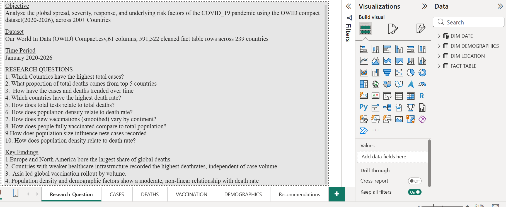
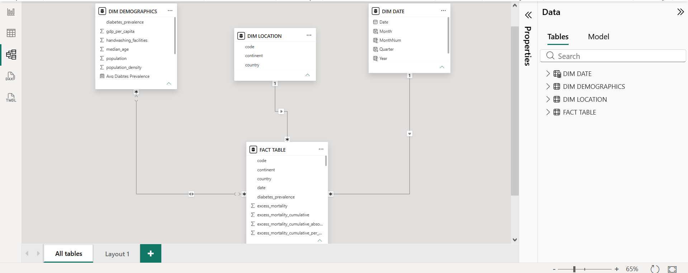
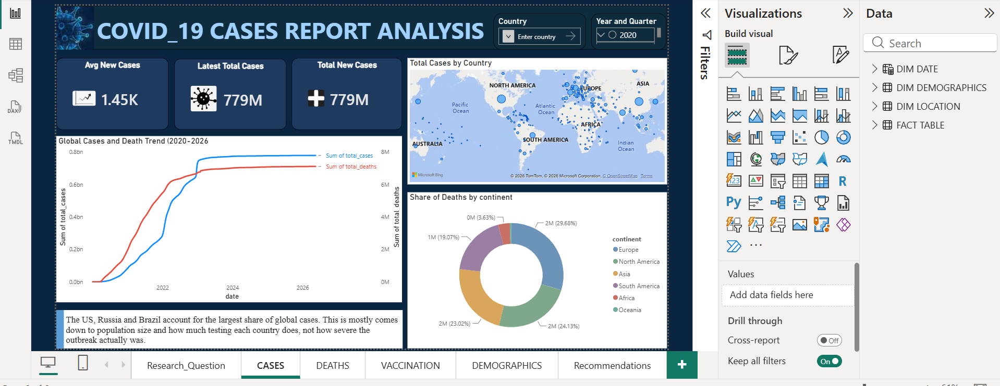
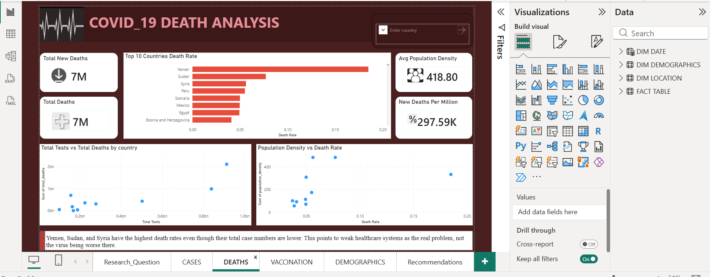
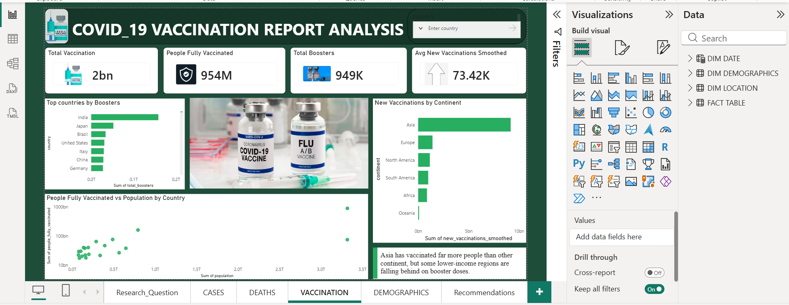
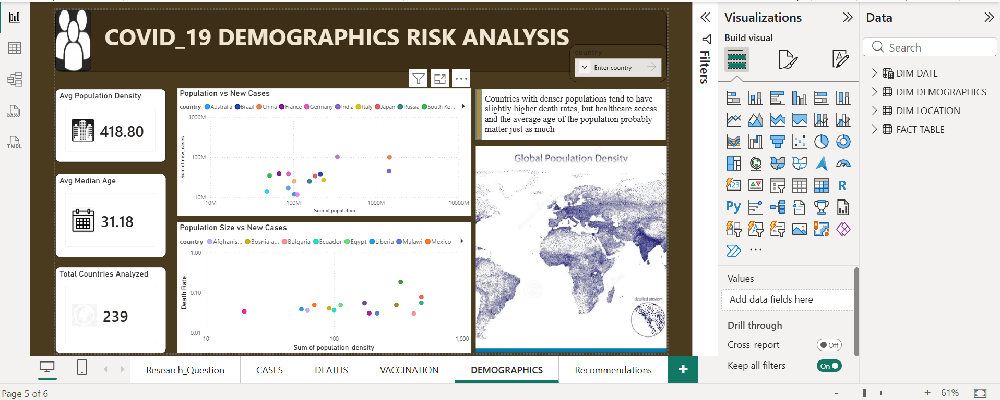
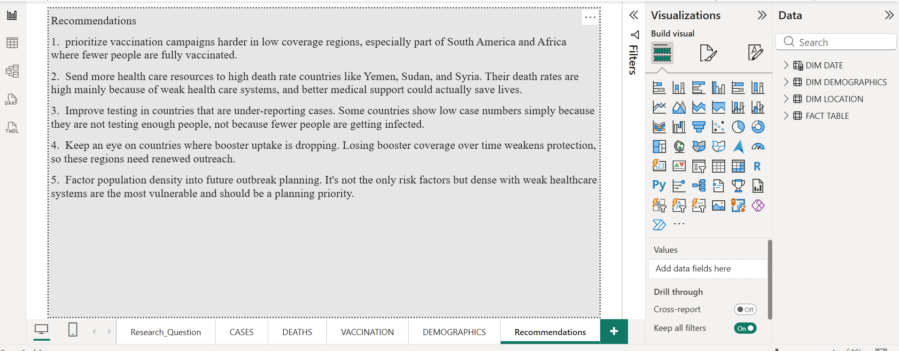

# COVID-19 Global Dashboard (Power BI)
An interactive Power BI report on the global spread and impact of COVID-19, built on the Our World in Data COVID-19 dataset. It covers confirmed cases, deaths and vaccinations, and how they compare across countries and over time.



### What it answers
- How did confirmed cases and deaths change over time, globally and by country?
- Which countries and regions were hit hardest, in total and per million people?
- How did vaccination rollout compare across countries?
### Data
Source: [Our World in Data COVID-19 dataset](https://github.com/owid/covid-19-data), licensed CC BY. Covers January 2020 onward, across 239 countries.
 ## Data model

Star schema with one fact table and three dimensions.

| Table | Type | Purpose |
|---|---|---|
| Fact_COVID | Fact | Daily case, death and vaccination figures |
| Dim_Date | Dimension | Calendar table for time analysis |
| Dim_Location | Dimension | Country, continent and region |
| Dim_Demographics | Dimension | Population and demographic fields |



## Report pages

| Page | What it shows |
|---|---|
| Research Question | Objective, dataset, time period, the research questions and key findings |
| Cases | New and cumulative confirmed cases over time |
| Deaths | Deaths over time and deaths per million by country |
| Vaccination | Doses administered and share of population vaccinated |
| Demographics | Population density and median age against cases and deaths, with a global density map |
| Recommendations | Recommendations drawn from the analysis |

## Screenshots

### Cases


### Deaths


### Vaccination


### Demographics


### Recommendations


## Key findings

Global totals as reported to the WHO (the source behind the Our World in Data figures):

1.	About 779 million confirmed cases and about 7.1 million reported deaths worldwide.
2.	That works out to a reported fatality rate of roughly 0.91%. Confirmed counts are lower than the true toll because of limited testing and differences in how countries report.
3. In this dataset, about 2 billion vaccinations are recorded and about 954 million people are fully vaccinated. WHO-reported worldwide totals are higher, at about 13.7 billion doses.
Country-level findings (cumulative, from Our World in Data):

4.	The United States had the most confirmed cases (about 103.4 million) and the most deaths (1,238,678), followed by Brazil (704,045) and India (533,849) in deaths.
5.	Peru had the highest death rate at 6,604 deaths per million, then Bulgaria (5,681) and North Macedonia (5,429). The world average is 894.
6.	Nigeria recorded 267,237 cases and 3,155 deaths, or 14 deaths per million.
7.	China (about 1.32 billion people, 92.5%) and India (about 1.03 billion, 72.1%) vaccinated the most people. Globally, 70.7% of people received at least one dose.
8.	Vaccination was very uneven. Nigeria reached 42.05% with at least one dose. Burundi (0.28%) and Yemen (2.75%) were among the lowest.

## Repository contents

```
README.md
covid_19 project_hiit.pbix    Power BI report
screenshots/                  One image per report page, plus the star schema
```

## How to open it

1. Download `covid_19 project_hiit.pbix`.
2. Open it in Power BI Desktop (Windows only).
3. If Power BI can't find the data, go to Transform data > Data source settings and point it to your local copy of the dataset.

## Skills demonstrated

- Data cleaning: cleaned and transformed the raw data in Power Query
- Data modelling: built a star schema with one fact table and three dimension tables
- DAX: wrote 16 measures for the report
- Dashboard design: built a six-page interactive Power BI report
- Data storytelling: summarised the findings in a 13-slide PowerPoint
- Data source: worked with the public Our World in Data COVID-19 dataset

## Credit

Data from [Our World in Data](https://ourworldindata.org/coronavirus).
